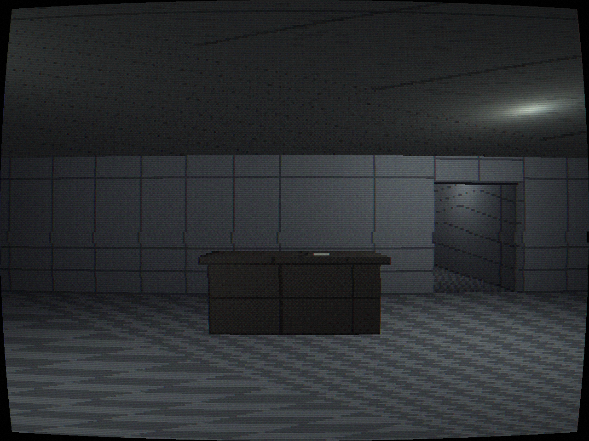
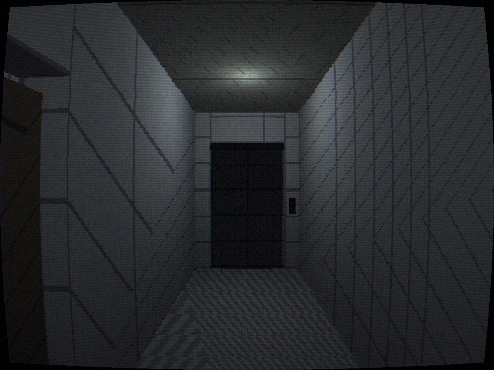
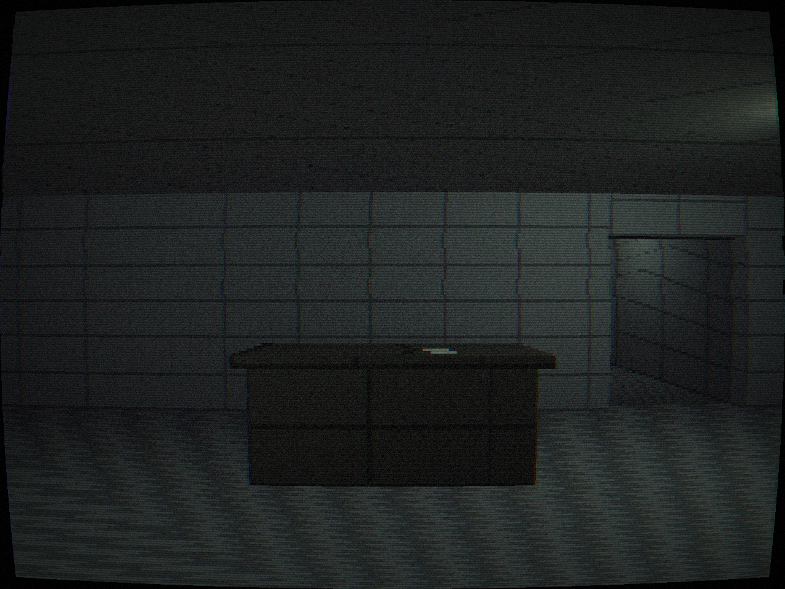

<h1 align="center">Vacancy</h1>

<p align="center">
  <em>A short first-person descent through the fluorescent-lit sublevels of a
  building that closed hours ago,<br>where every empty room you walk into looks a
  little more like the last one you tried to leave.</em>
</p>

<p align="center">
  
</p>

<p align="center">
  <a href="media/walkthrough.mp4">▶ Watch the full walkthrough (MP4)</a>
  &nbsp;·&nbsp;
  <strong>Built twice — once in <a href="godot-port/">Godot</a>, once in <a href="raylib-port/">raylib&nbsp;6 / C</a></strong>
  &nbsp;·&nbsp;
  <a href="GODOT_VS_RAYLIB.md">Engine comparison →</a>
</p>

---

*Vacancy* is a PSX/VHS-styled **liminal-space horror walker**. It is small, quiet,
and deliberately ugly in the way old hardware was ugly. There is no combat, no
inventory, no enemy, and no chase. You move, look, crouch, interact — and you take
the elevator **down**. The dread is built entirely out of repetition, wrongness,
and restraint. A full playthrough runs **10–20 minutes**.

Each descent opens onto another sublevel that is *almost* the floor you just left —
the same corridors, the same doors, the same hum — but something is off. A light
that was steady now stutters. A chair has turned to face the wrong way. A door that
was shut stands ajar. None of it is loud. Each individual wrongness is small enough
to talk yourself out of. They accumulate.

> The most frightening thing the game does is, occasionally, on arrival at a new
> floor, cut every sound to total silence for two seconds.

---

## Gallery

| | |
|:-:|:-:|
|  |  |
| **The lobby** — where it starts, and where it ends | **A sublevel corridor** — the same building, made wrong |
|  |  |
| **The elevator** — the spine of the game; it only goes down | **The wrong final lobby** — lit sickly green, with no way out |

## The look is the engine

The whole 3D world is rendered the way a 1997 console would have, and the jank is
the art direction. Everything renders into a **320×240** buffer with **PSX vertex
snapping** (geometry jitters to a coarse grid) and **affine texture mapping**
(perspective-incorrect UVs, so textures swim). Then a two-stage post chain — an
ordered-dither / bit-crunch pass, then a **VHS/CRT** pass (scanlines, barrel
distortion, chromatic aberration, tracking noise, roll) — degrades the picture
further the deeper you go. The picture decaying *is* the building decaying.

<p align="center">
  
</p>

---

## Two engines, one game

This repo contains the **same game built twice**, from the same design, with the
same layout, systems, audio, anomalies, and ending — on two completely different
foundations:

| | [`godot-port/`](godot-port/) | [`raylib-port/`](raylib-port/) |
|---|---|---|
| **Engine** | Godot 4.6 (Forward+) | raylib 6.0 (built from source) |
| **Language** | GDScript | C (C11) |
| **World** | scenes (`.tscn`) + nodes | hand-built meshes + colliders in code |
| **Lighting** | engine omni lights + shadows | per-room point lights in a shader |
| **Audio** | engine buses + reverb | hand-rolled mixer + Schroeder reverb |
| **Ships as** | 68 MB self-contained binary | **1.7 MB** binary, system libs only |
| **Build** | Godot editor + export templates | any C compiler + `make` |

Both were built with Claude. A detailed, measured writeup — line counts, `scc`
complexity, build cost, performance, binary size, and where each engine helps or
fights you — lives in **[GODOT_VS_RAYLIB.md](GODOT_VS_RAYLIB.md)**.

> **The one-number version:** by `scc` the two builds are nearly the same *size*
> (1,971 vs 2,141 code lines) but the C port carries **~2.4× the cyclomatic
> complexity** (185 → 435) — because in raylib you write the collision, lighting,
> audio mixing, and state machines the engine otherwise hands you for free.

---

## How it plays

| Input | Action |
|---|---|
| **W A S D** | move |
| **Mouse** | look |
| **Shift** (hold) | walk slowly |
| **Ctrl** (hold) | crouch |
| **E** | interact — open/close doors, press elevator buttons, read notes |
| **Esc** | release the mouse cursor; dismiss a note |

It's a walking sim. Movement is deliberately slow (~3 m/s) — this is a game you are
meant to move through carefully, listening. A subtle distance-keyed headbob keeps
footsteps in sync at any speed; footstep timbre changes with the floor surface.

## Quick start

**raylib / C** (tiny, self-bootstrapping — fetches & builds raylib on first run):

```sh
cd raylib-port
./build.sh        # clones + builds raylib 6.0, then the game
./build/vacancy   # run from this directory
```

**Godot:** open `godot-port/` in Godot 4.6 and press Play, or:

```sh
cd godot-port && ./run.sh
```

---

## How it ends

<details>
<summary>This spoils the ending — which <em>is</em> the point of the game. Click to expand.</summary>

<br>

After enough descents (seven, by default) the doors open not onto another sublevel
but onto the **original lobby** — the one you started in. Except it's empty, dimmed,
and lit a sickly green; one tube is dead and another flickers. The desk note has
changed. The front doors — locked all night — are now unlocked.

You walk to them, you push them open, and you are standing back at the elevator.
The exit leads inward. There is no way out. You read the last note, the screen
fades, a title holds for a moment in the dark, and that's it. No reveal, no
creature, no explanation. *The horror is that there's no exit.*

</details>

---

## Repository layout

```
.
├── README.md              this file
├── SPEC.md                the original design brief both builds were made from
├── GODOT_VS_RAYLIB.md     measured engine comparison
├── media/                 screenshots + walkthrough capture
├── godot-port/            the Godot 4.6 / GDScript implementation
└── raylib-port/           the raylib 6.0 / C implementation
```

Each implementation has its own README with build instructions, a file-by-file
map, and its dev tooling (telemetry, dev flags, self-tests).

## Design statement

Restraint over spectacle. Empty, quiet, fluorescent, slightly wrong. The guiding
rule throughout: *if a feature makes the game louder, it's probably wrong for
Vacancy.* The fear is supposed to come from an ordinary place made subtly
uninhabitable, and from the slow certainty that the way out isn't where you left
it.
