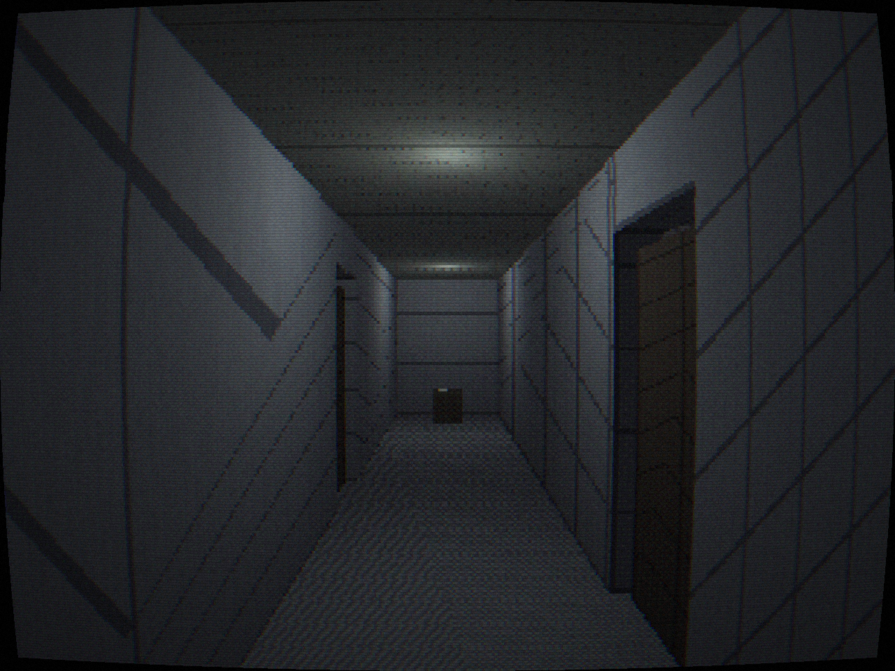
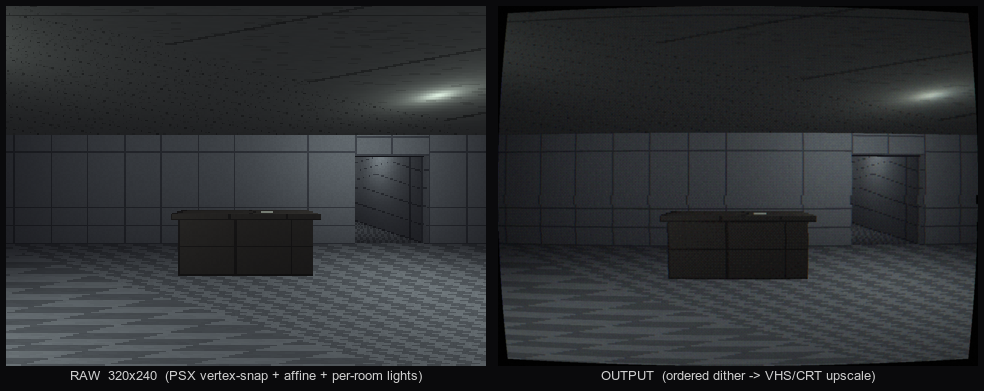

<h1 align="center">Vacancy — raylib 6 / C</h1>

<p align="center">
  
</p>

<p align="center">
  A from-scratch <strong>C / raylib 6.0</strong> rebuild of <em>Vacancy</em> — no
  engine, no scene files, no editor.<br>
  <a href="../README.md">← Game overview</a> ·
  <a href="../godot-port/">Godot original</a> ·
  <a href="../GODOT_VS_RAYLIB.md">Engine comparison</a>
</p>

---

This is a faithful, from-scratch reimplementation of the Godot original in
[`../godot-port/`](../godot-port/): the same descent loop, the same data-driven
anomaly engine, the same procedural PSX/VHS render pipeline, the same procedural
audio, and the same no-exit ending — using raylib instead of Godot. Everything the
Godot version got from nodes, scenes, physics, lights, and audio buses is built by
hand here in ~2,600 lines of C and four GLSL shaders.

## Build & run

Requires a C compiler, `make`, and `git`. The build script clones **raylib 6.0**
into `vendor/` and builds it as a static library on first run, then compiles the
game:

```sh
./build.sh        # bootstraps raylib + builds build/vacancy
./run.sh          # builds, then runs with telemetry -> run.log
```

Or directly, once raylib is vendored:

```sh
make              # -> build/vacancy
./build/vacancy   # run from this directory (shaders load via relative paths)
```

The binary links only system frameworks (OpenGL, Cocoa/X11) and weighs ~1.7 MB.

## Controls

| Input | Action |
|---|---|
| **W A S D** | move |
| **Mouse** | look |
| **Shift** (hold) | walk slowly |
| **Ctrl** (hold) | crouch |
| **E** | interact — open/close doors, press elevator buttons, read notes |
| **Esc** | release the mouse cursor (click to re-capture); dismiss a note |

## How it's built

The render pipeline is the heart of it. The 3D world draws into a **320×240**
render texture with a PSX material, gets crunched by an ordered-dither pass at that
internal resolution, then a VHS/CRT pass upscales it to the window:

<p align="center">
  
</p>

```
            ┌─────────────────────────────────────────────────────────────┐
 world ───► │ RenderTexture 320×240                                        │
            │   psx.vs : vertex-snap to a coarse grid + affine UV (×w/÷w)  │
            │   psx.fs : per-room point lights (≤8) + flat ambient         │
            └───────────────┬─────────────────────────────────────────────┘
                            ▼
            ┌─────────────────────────────────────────────────────────────┐
 dither ──► │ RenderTexture 320×240 — dither.fs : Bayer 4×4 + 15-bit crunch│
            └───────────────┬─────────────────────────────────────────────┘
                            ▼
 screen ──► vhs.fs : barrel + chroma + scanlines + noise + roll (depth-scaled)
            ▲
 UI    ──── DrawText overlay (crisp, native res) on top
```

A few design points specific to the C build:

- **Lighting is bound per room.** raylib has no built-in lighting, so each room's
  surfaces are lit only by that room's point lights (uploaded as shader uniform
  arrays before drawing the room). No shadow maps — this is how cross-wall light
  leak is avoided without them.
- **Collision is 2D.** The game is flat (no jump), so movement is horizontal and
  collision is cylinder-vs-AABB sliding against wall/prop/door boxes. Open doors
  drop their collider so you can walk through.
- **Geometry is code.** The Godot scene graph (~1,000 lines of `.tscn`) is a
  424-line builder in `world.c` — boxes with carved doorways, grouped by room,
  with colliders generated alongside.
- **All audio is procedural.** `synth.c` generates every sound as a `Wave` at
  runtime; `audio.c` is a small voice pool with positional pan/attenuation, a
  compact Schroeder reverb (the Sfx-bus stand-in), looping beds via raylib `Music`,
  and the silence-as-a-tool ducking.

### Module map (→ Godot original)

| `src/` | Godot original |
|---|---|
| `main.c` | `Main.tscn` + `main.gd` (frame loop, UI, fades, ending, dev flags) |
| `render.c` + `shaders/` | the SubViewport post chain + `shaders/*.gdshader` |
| `world.c` | `Floor_*`/`FloorBase`/prop scenes + `gen_textures.gd` |
| `player.c` | `player.gd` (movement, look, crouch, bob, footsteps, collision) |
| `entities.c` | `door.gd`, `elevator.gd`, `elevator_button.gd`, `fx_flicker.gd` |
| `interact.c` | the player's interact raycast / `interactable.gd` |
| `floor_manager.c` | `floor_manager.gd` (descent, world swap, ending setup) |
| `anomalies.c` | `loop_controller.gd` + `scripts/anomalies/*` |
| `audio.c` + `synth.c` | `audio_director.gd` + `sound_synth.gd` |
| `game_state.c` / `telemetry.c` / `rng.c` | `game_state.gd` / `telemetry.gd` / seeding |

## Dev flags & tooling

Full parity with the Godot build's tooling, plus the demo/record capture used for
this repo's walkthrough video.

| Flag | Effect |
|---|---|
| `--telemetry-log=PATH` | write JSON-lines telemetry (heartbeat + events) to PATH |
| `--depth=N` | pretend you've descended N times (scales look/audio/anomalies) |
| `--sublevel` | boot straight onto a sublevel floor |
| `--ending` | boot straight onto the wrong final lobby |
| `--pose=x,z,yaw` | place the player (for screenshots); applied after any floor swap |
| `--screenshot=PATH` | save the post-processed window and the raw 320×240 render (`PATH_raw.png`), then quit |
| `--selftest` | exercise doors, a note, and two full descents with no input, then quit |
| `--endtest` | exercise the end beat (false exit + final note + cut to black), then quit |
| `--demo` | drive a hands-off first-person walkthrough (lobby → elevator → descend → sublevel) |
| `--record=DIR` | with `--demo`, dump every other frame (fixed 60 Hz timestep) to `DIR/fNNNNN.png` |

Telemetry is also enabled by `VACANCY_TELEMETRY_LOG`. The walkthrough GIF/MP4 in
[`../media/`](../media/) were captured with `--demo --record=…` and encoded with
ffmpeg.

## Where the port deviates (and why)

The game logic, layout, dimensions, timings, and aesthetics are reproduced
faithfully. Three implementation details differ because raylib gives you GL
plumbing rather than an engine:

- **No real-time shadows.** Lighting is bound per room (above) instead of
  shadow-mapped. Faithful under the heavy VHS murk; a hard lighting seam in open
  doorways is the only tell.
- **Reverb is a small algorithmic stand-in** for Godot's `AudioEffectReverb` bus,
  scaled by the same depth/space curve. The dry ambient beds (the 70% that matters)
  are unchanged.
- **Anomaly RNG isn't bit-identical.** The engine reproduces the *property* —
  deterministic per `(depth, visits, room)`, depth-weighted, differing on each
  revisit — but uses its own hash + PCG32, so which anomalies fire on a given floor
  won't match the Godot seed.

Everything else — the 320×240 internal render, vertex snapping, affine texture
swim, dither + VHS/CRT post, the 7-descent structure, the anomaly catalogue, the
silence-as-a-tool audio, the false-exit ending — is a direct reproduction.
